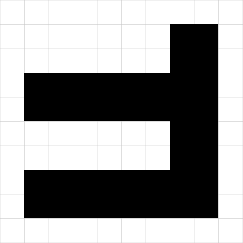

# SS24-ObjectOrientedProgramming

## Übung 1

### 1. Geometrische Figuren

Implementieren Sie eine Klasse `Rectangle` zur Darstellung zweidimensionaler, achsenparalleler Rechtecke (d.h. sie
können von zwei Punkten aufgespannt werden). Diese Punkte sollen mit Hilfe einer Klasse `Point` dargestellt werden. Die
Koordinaten sind ganzzahlige Werte!

Für die Klasse `Rectangle` sind die folgenden Operationen zu realisieren:

- Erzeugen von Rechtecken, die an beliebigen Positionen stehen können
- Verschieben eines Rechtecks
- Prüfen auf Quadrat-Eigenschaft
- Bestimmen des Umfangs eines Rechtecks
- „Zoomen“ eines Rechtecks: Unter der Angabe von einem Faktor werden sowohl die Länge als auch die Breite vergrößert
  bzw. verkleinert.
- Teilen eines Rechtecks in vier gleich große Rechtecke
- Teilen eines Rechtecks entlang einer der Diagonalen in zwei Dreiecke

```
    public static void main(String[] args) {
        Rectangle r1 = new Rectangle(
                new Point(350, 50),
                new Point(450, 450),
                "black"
        );

        Rectangle r2 = new Rectangle(
                new Point(50, 150),
                new Point(350, 250),
                "black"
        );

        Rectangle r3 = new Rectangle(
                new Point(50, 350),
                new Point(350, 450),
                "black"
        );

        System.out.printf("<svg height='%d' width='%d' xmlns='http://www.w3.org/2000/svg'>%n", 501, 501);
        System.out.println(Main.grid);
        System.out.println(r1);
        System.out.println(r2);
        System.out.println(r3);
        System.out.println("</svg>");
    }
```


